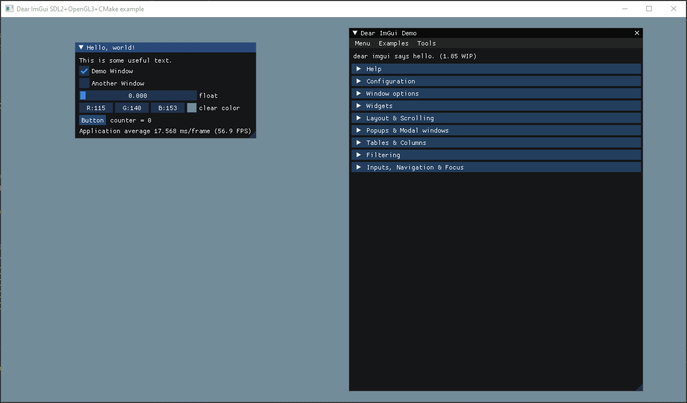

# Introduction

A minimal example project for [Dear ImGui](https://github.com/ocornut/imgui) 
with [SDL](https://www.libsdl.org/) and [SDL_image](https://www.libsdl.org/projects/SDL_image/) 
using [CMake](https://cmake.org/) and [Git](https://git-scm.com/) submodules to keep everything self-contained.



### Usage

- Clone the repository thusly to also fetch the submodule repositories (assuming you're using a relatively recent version of git):
```bash
$ git clone --recurse-submodules https://github.com/bploeckelman/sdl_image.git
```

- Open the cloned folder in an IDE like [Clion](https://www.jetbrains.com/clion/) and cross your fingers while CMake does it's business...

- Run the default `sdl_imgui` run configuration and hopefully everything just works!

## Motivation

Finding useful examples of getting SDL up and running in a self-contained way, (ie. without downloading a set of pre-built development binaries, setting up search paths, etc...) has been a real annoyance over the years.

Setting up a repository to include the source for the required libraries as git submodules seems to be a reasonable alternative, but getting SDL and ImGui to play nice with each other using this has been harder than it seems like it should be, so I setup this minimal example project that works out of the box (*normal caveats apply, works on my machine, etc...*)

This may or may not be a good way to set this stuff up, but on the off chance that it can help others who were running into similar problems to me, then great!

## References

I opened and closed a lot of browser tabs during the development of this repo, here are some that I still have open and found at least somewhat valuable...

- https://github.com/tcbrindle/sdl2-cmake-scripts
  - (if you want to try it the old-fashioned way)
- https://github.com/retifrav/sdl-imgui-example
- https://marcelfischer.eu/blog/2019/sdl-opengl-cmake/
- https://marcelfischer.eu/blog/2019/imgui-in-sdl-opengl/
- https://blog.wasin.io/2018/10/31/integrate-cimgui-with-sdl2-in-c-code.html
- https://decovar.dev/blog/2019/05/26/sdl-imgui/
- https://github.com/ocornut/imgui/wiki/Image-Loading-and-Displaying-Examples#example-for-opengl-users
- https://github.com/Tyyppi77/imgui_sdl
- https://github.com/shxy0/SDLImGui
- https://github.com/aaronmjacobs/InitGL
- https://pabloariasal.github.io/2018/02/19/its-time-to-do-cmake-right/
- https://www.youtube.com/watch?v=rLopVhns4Zs

## Quirks

- SDL_image isn't really used in this example but I wanted to have a working example for my own projects. Setting up [stb_image](https://github.com/nothings/stb) would probably be better, though it's a bit more advanced to use so that's left as an exercise for the reader.
- CMake deletes `libs/sdl_image/external/zlib-1.2.11/zconf.h` during the build process, leaving the `libs/sdl_image` dependency in a modified state.
  - This doesn't cause any problems with the build, but it is unsatisfying to have an unstaged change just hanging out in git. Open to suggestions for how to handle this.
- There may also be some modifications to `libs/sdl_image` in the `Xcode/Frameworks/webp.framework` subdirectories but I was able to revert these in the submodule folder and they didn't come back, so ¯\_ (ツ)_/¯
- **SDL and SDL_image are statically linked**
  - I know there are issues with this but I find it more convenient than setting up CMake custom commands to copy shared libs into build folders as a post-build step in order to run while developing.

If you'd rather link things dynamically, the following changes may work (untested):
```CMake
## Remove the cmake variables that trigger static compilation
## - set(SDL_STATIC ON CACHE BOOL "" FORCE)
## - set(SDL_SHARED OFF CACHE BOOL "" FORCE) 
## - set(BUILD_SHARED_LIBS OFF CACHE BOOL "" FORCE)

## Change the target_link_libraries call to use the non-static SDL2 lib
target_link_libraries(sdl_imgui opengl32 SDL2 SDL2_image imgui)

## NOTE: not sure off the top of my head what cmake vars to use to pick out the correct dll name, so this is windows / debug only

## copy SDL2 dll to the build directory
set(SDL2_DLL "${PROJECT_BINARY_DIR}/libs/sdl/SDL2d.dll")
if (EXISTS ${SDL2_DLL})
    add_custom_command(
            TARGET sdl_imgui POST_BUILD
            COMMAND ${CMAKE_COMMAND} -E copy
            ${SDL2_DLL}
            $<TARGET_FILE_DIR:sdl_imgui>
    )
endif()

## copy SDL_image dll and associated dlls to the build directory
set(SDL_IMAGE_DLL "${PROJECT_BINARY_DIR}/libs/sdl_image/SDL2_image.dll")
set(SDL_IMAGE_PNG_DLL "${PROJECT_BINARY_DIR}/libs/sdl_image/external/libpng-1.6.37/libpng16d.dll")
set(SDL_IMAGE_ZLIB_DLL "${PROJECT_BINARY_DIR}/libs/sdl_image/external/zlib-1.2.11/zlibd1.dll")
if (EXISTS ${SDL_IMAGE_DLL}
AND EXISTS ${SDL_IMAGE_PNG_DLL}
AND EXISTS ${SDL_IMAGE_ZLIB_DLL})
    add_custom_command(
            TARGET sdl_imgui POST_BUILD
            COMMAND ${CMAKE_COMMAND} -E copy
            ${SDL_IMAGE_DLL}
            ${SDL_IMAGE_PNG_DLL}
            ${SDL_IMAGE_ZLIB_DLL}
            $<TARGET_FILE_DIR:sdl_imgui>
    )
endif()
```